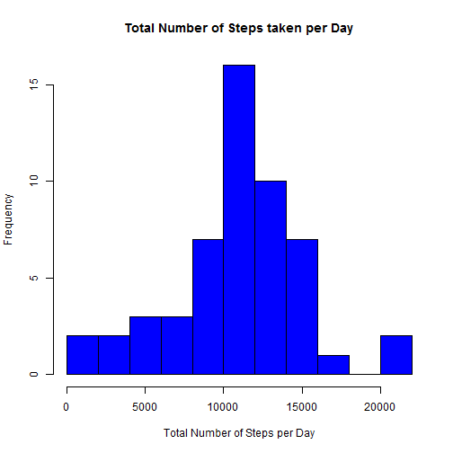
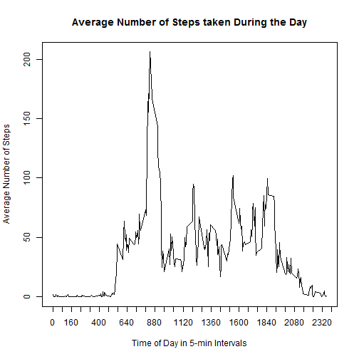
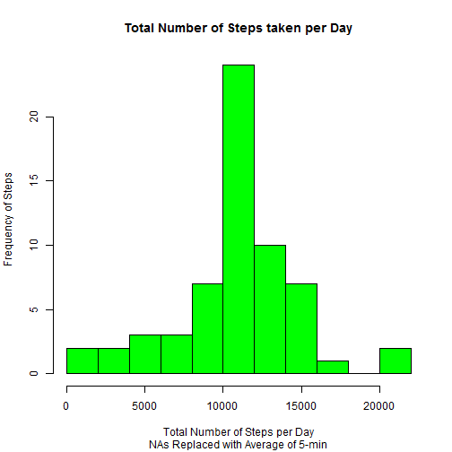
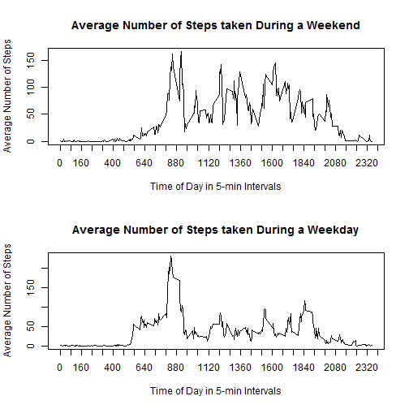

#PA1_template
================================================
================================================

This is Reproducible Research Peer Assignment 1

This data is from a personal activity monitoring device measuring the average number of steps taken in a 5-min interval during the day from October 1, 2012 to November
30, 2012. 

================================================

```r
library(dplyr)  ##Loading Libraries
library(chron)
```
The first task is the load and clean the data. The dates are not in 'proper' Date format so that will need to be fixed. 

```r
####Loading and Cleaning Data
step_data = (read.csv("activity.csv")) ##Reading the Data
AllData = step_data %>% ##Setting the table to be used as Datas
  mutate(dated = as.Date(date)) %>% ##Creating a column in date format
  select(steps, interval, dated) ##Deleting the non-date format date column

CompleteData = filter(AllData, complete.cases(steps)) ##Removing all NA cases
```
Let us first look at a histogram of the total number of steps taken per day. The histogram will show the frequency of the number of steps in a day.

```r
####Total Steps per Day 
tableOfTotalSteps = tapply(CompleteData$steps, CompleteData$dated, sum)  
####Histogram of Steps Per Day
hist(as.numeric(tableOfTotalSteps), breaks = 12, xlab = "Total Number of Steps per Day", ylab = "Frequency", main = "Total Number of Steps taken per Day", col = "Blue")
```

 

The Mean Number of Steps Taken per Day is:

```r
print(as.integer(mean(tableOfTotalSteps)))  ##Printing and rounding average
```

```
## [1] 10766
```
The Median Number of Steps Taken per Day is:

```r
print(as.integer(median(tableOfTotalSteps)))  #Printing and rounding median
```

```
## [1] 10765
```
We can also plot the average number of steps taken throughout the day. 

```r
TimeofDay = times(sprintf( "%d:%02d:00", AllData$interval %/% 100, AllData$interval %% 100 ))  #Converting 5min intervals into 00:00:00 format
MeanStepsMinute = tapply(CompleteData$steps, CompleteData$interval, mean) #Creating a vector of the average steps per 5-min interval
DayandTime = as.POSIXct(paste(AllData$dated, TimeofDay))  ##Creating a vector of time and day in Y-M-D H:M:S format
```
The Highest Average Number of Steps Taken During the Day is at around 8:80 AM(Maybe a morning jog):

```r
print(max(MeanStepsMinute))
```

```
## [1] 206.1698
```

```r
plot(CompleteData[1:288,2], MeanStepsMinute, type = "l", xlab = "Time of Day in 5-min Intervals", ylab="Average Number of Steps", main = "Average Number of Steps taken During the Day", xaxp=c(0,2400,30) )   ###Creating a plot of average steps taken during day
```

 

There are a number of times were the data is not available (maybe the battery died), in these cases the number of steps is NA. For example, all of October 1, 2012 is NA. We can find the number of NA values. The Number of NA Values in the Set is:

```r
numNA = sum(is.na(AllData[,1]))
numNA
```

```
## [1] 2304
```
The data not being available does not mean it does not exist. The person probably did take steps during those times, so we can replace the NA values with the overall average during the same 5-min interval. With the NA values replaced, we can again create a histogram to see the frequency of steps taken per day. However, since the number of NA values is very small the data is not expected to change much. 

```r
StepTaken = AllData[,1]  ##Replacing the NA with the average of the 5 min interval
StepTaken[is.na(StepTaken)] <- MeanStepsMinute
###Replacing the step column
AllDataNoNA = AllData %>% 
mutate(Steps_no_Na = StepTaken) %>% 
select(Steps_no_Na, interval, dated)
TotalSteps = tapply(AllDataNoNA$Steps_no_Na, AllDataNoNA$dated, sum)
hist(as.numeric(TotalSteps), breaks = 12, xlab = "Total Number of Steps per Day", ylab = "Frequency of Steps", main = "Total Number of Steps taken per Day", sub = "NAs Replaced with Average of 5-min", col="Green")
```

 

The Average Number of Steps Taken per Day is:

```r
print(as.integer(mean(TotalSteps)))  ##Printing and rounding average
```

```
## [1] 10766
```
The Average Number of Steps Taken per Day is:

```r
print(as.integer(median(TotalSteps)))  #Printing and rounding median
```

```
## [1] 10766
```
The mean and median steps per day do not change when the NA values are replaced with the 5-min overall mean. 

We can then see if there is a difference in the number of steps taken on the weekdays verse the weekends. 

```r
###Creating a new column of the days
AllDataDaysType = AllDataNoNA %>% 
  mutate(Day = weekdays(AllDataNoNA$dated, abbreviate = TRUE)) 
###Creating two tables for the steps taken on the weekends and weekdays
Weekend = cbind(AllDataDaysType$interval[AllDataDaysType$Day %in% c("Sat", "Sun")], AllDataDaysType$Steps_no_Na[AllDataDaysType$Day %in% c("Sat", "Sun")])
Weekday = cbind(AllDataDaysType$interval[AllDataDaysType$Day %in% c("Mon", "Tue", "Wed", "Thu", "Fri")], AllDataDaysType$Steps_no_Na[AllDataDaysType$Day %in% c("Mon", "Tue", "Wed", "Thu", "Fri")])
###Average Steps
MeanStepsWeekend = tapply(Weekend[,2], Weekend[,1], mean)
MeanStepsWeekday = tapply(Weekday[,2], Weekday[,1], mean)
###plotting
par(mfrow=c(2,1))
plot(CompleteData[1:288,2], MeanStepsWeekend, type ="l", xlab = "Time of Day in 5-min Intervals", ylab="Average Number of Steps", main = "Average Number of Steps taken During a Weekend", xaxp=c(0,2400,30) )
plot(CompleteData[1:288,2], MeanStepsWeekday, type="l", xlab = "Time of Day in 5-min Intervals", ylab="Average Number of Steps", main = "Average Number of Steps taken During a Weekday", xaxp=c(0,2400,30) )
```

 
As we can see above, the average number of steps taken during the weekend is higher after around 10AM.
